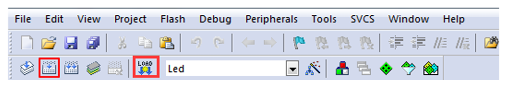
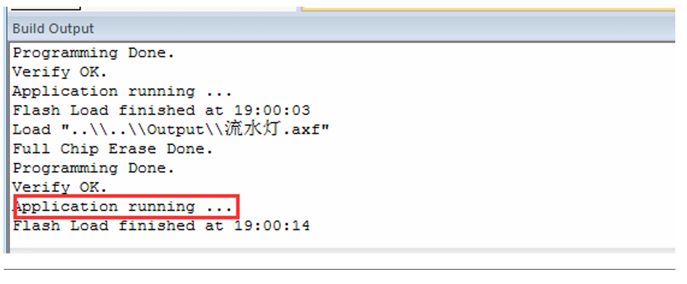

## Keil5 环境配置

### 温馨提示
1) **安装路径不能带中文**，必须是英文路径。
2) 安装目录不能跟51的KEIL或者KEIL4冲突，三者目录必须分开。
3) KEIL5 的安装比起KEIL4多了一个步骤，**必须添加MCU库**，不然没法使用。

### 获取KEIL5安装包
官网下载需要注册，略微麻烦，建议使用以下网盘下载安装包：https://pan.baidu.com/s/1T_kvjzI8F-0YpCBuI4EJjA?pwd=kdtk 

### 开始安装 KEIL5
1) 右键以管理员运行

2) Next



3) Agree, Next



4) 选择安装路径，路径不能带中文，next（提示：Pack目录下后续可能会安装以后会用到的各种芯片的芯片包，容易占空间，**建议更改Pack路径为D盘**）



5) 填写用户信息，全部空格（键盘的space键）即可，next



6) Finish，安装完毕（安装结束会弹出器件支持包安装界面，选择关闭，后面根据需要再安装）



### 注册许可证
1) 右键Keil5软件，以管理员身份运行（以防止无法注册成功）



2) 点击File，选择License Management



3) 以管理员身份运行注册工具（声音较吵，建议调小音量）



4) 复制CID到注册工具，**选择ARM**，点击Generate生成注册码，将注册码复制到LIC



5) 点击添加，显示添加成功



### 汉化包安装
1) 打开ZH_CN文件夹，右键复制



2) 右键桌面KEIL5图标，打开文件所在位置



3) 选择替换，之后双击桌面图标启动即可



### 器件支持包安装
器件支持包有两种安装方式，分别是在线安装（网络慢，不建议）和离线安装（推荐，速度快），以下将介绍离线安装的方式。
1) 双击已经下载的支持包，点击下一步



2) 安装完成，结束



## 认识 KEIL5

### 认识KEIL5界面
1) KEIL5的主窗口界面包括：
 菜单栏：包含File文件、Edit编辑、Project工程、Help帮助等 
 工具栏：常见工具的快捷按钮，下面会重点介绍一些常用的工具
 工程窗口：主要显示项目内容，文件组、源文件和头文件等
 编辑窗口：编写代码的地方 
 消息窗口：反馈编译信息、烧录信息等 
 状态栏：光标的行列位置、字符编码、键盘NUM锁定等一些状态信息



2) 三类常用工具快捷按钮



 仿真类快捷按钮：在进行仿真时使用，具有断电标记作用

| 英文名称 | 中文描述 | 快捷键 |
|:--------:|:--------:|:------:|
| Start/Stop Debug Session | 打开/关闭调试 | Ctrl+F5 |
| Insert/Remove Breakpoint | 插入/移除断点 | F9 |
| Enable/Disable Breakpoint | 使能/失能断点 | Ctrl+F9 |
| Disable All Breakpoints | 失能所有断点 | - |
| Kill All Breakpoints | 取消所有断点 | Ctrl+Shift+F9 |

 编译类快捷按钮：对代码进行编译下载

| 英文名称 | 中文描述 | 快捷键 |
|:--------:|:--------:|:------:|
| Translate | 编译当前文件 | Ctrl+F7 |
| Build | 编译工程目标 | F7 |
| Rebuild | 重新编译所有目标文件 | - |
| Batch Build | 分批编译(多工程) | - |
| Stop Build | 停止编译(正在编译时有效) | - |
| Download | 下载 | F8 |

 工程目标选项又称魔术棒：即对工程目标的配置，如芯片设备选择、C/C++选项、仿真配置等等

### 如何使用DAP仿真器配置下载目标
本课程配套的仿真器为Fire-Debugger，**遵循ARM公司的CMSIS-DAP标准**，支持所有基于Cortex-M 内核的单片机，支持下载和在线仿真程序，支持XP/WIN7/WIN8/WIN10这四个操作系统，不需要安装驱动即可使用，支持KEIL和IAR直接下载，非常方便。



Fire-Debugger只要插到电脑能绿灯就行(如果红灯尝试换USB线和换电脑USB口)。在仿真器连接好电脑和开发板且开发板供电正常的情况下，打开编译软件KEIL，在魔术棒选项卡里面选择仿真器的型号，具体过程看图示：
1) Debug 选项



2) Utilities 选项配置



3) Debug → Setting → Debug选项配置



4) Debug → Setting → Flash Download 选项配置
选择目标板，具体选择多大的FLASH要根据板子上的芯片型号决定。野火STM32开发板的配置是：F1选512K，F4选1M。



### 下载程序
如果前面步骤都成功了，接下来就可以把编译好的程序下载到开发板上运行。要先点编译（Build）， 确认编译正确后再点击下载，下载程序不需要其他额外的软件，直接点击KEIL中的LOAD按钮即可。



程序下载后，BuildOutput 选项卡如果打印出Application running⋯则表示程序下载成功。如果没有出现实验现象，按复位键试试。



